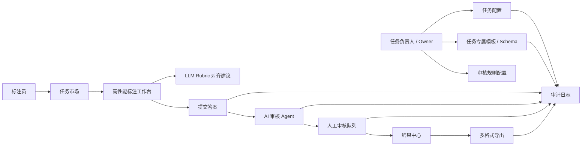
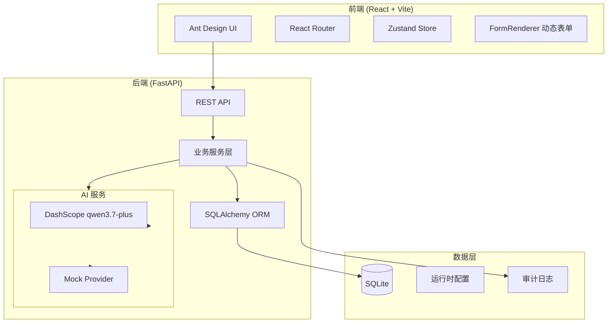
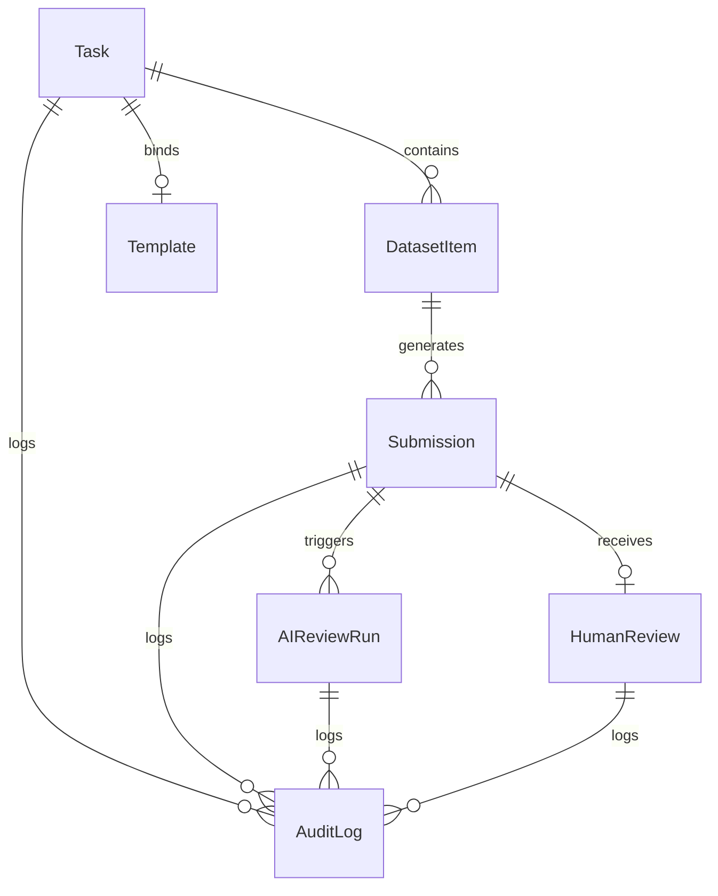

# 项目架构图

## 系统架构

```mermaid
flowchart LR
  Owner[任务负责人 / Owner] --> Task[任务配置]
  Owner --> Template[任务专属模板 / Schema]
  Owner --> Rule[审核规则配置]
  Labeler[标注员] --> Market[任务市场]
  Market --> Workbench[高性能标注工作台]
  Workbench --> LLM[LLM Rubric 对齐建议]
  Workbench --> Submit[提交答案]
  Submit --> Agent[AI 审核 Agent]
  Agent --> Review[人工审核队列]
  Review --> Result[结果中心]
  Result --> Export[多格式导出]
  Task --> Audit[审计日志]
  Template --> Audit
  Submit --> Audit
  Agent --> Audit
  Review --> Audit
  Export --> Audit
```

## 技术架构

```mermaid
flowchart TB
  subgraph Frontend["前端 (React + Vite)"]
    UI[Ant Design UI]
    Router[React Router]
    Store[Zustand Store]
    Renderer[FormRenderer 动态表单]
  end

  subgraph Backend["后端 (FastAPI)"]
    API[REST API]
    Service[业务服务层]
    ORM[SQLAlchemy ORM]
    AI[AI Provider 抽象层]
  end

  subgraph Data["数据层"]
    DB[(SQLite)]
    Config[运行时配置]
    Logs[审计日志]
  end

  subgraph AI["AI 服务"]
    DashScope[DashScope qwen3.7-plus]
    Mock[Mock Provider]
  end

  UI --> API
  API --> Service
  Service --> ORM
  ORM --> DB
  Service --> AI
  AI --> DashScope
  AI --> Mock
  Service --> Logs
```

## 数据模型

```mermaid
erDiagram
  Task ||--o{ DatasetItem : contains
  Task ||--o| Template : binds
  DatasetItem ||--o{ Submission : generates
  Submission ||--o{ AIReviewRun : triggers
  Submission ||--o| HumanReview : receives
  Task ||--o{ AuditLog : logs
  Submission ||--o{ AuditLog : logs
  AIReviewRun ||--o{ AuditLog : logs
  HumanReview ||--o{ AuditLog : logs
```
